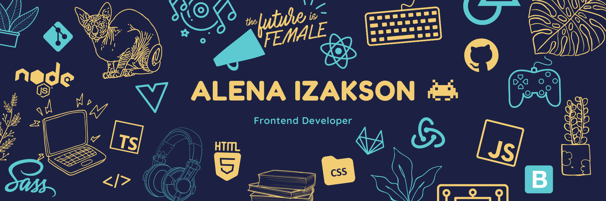

:pencil2: React + Typescript [To-Do-List](https://todo-dodo.netlify.app/) app ([source code](https://github.com/AlenaAlyona/todo_list))

:zap: Vue [WEATHER-VUEAPP](https://weather-vueapp.netlify.app/) app ([source code](https://github.com/AlenaAlyona/weather_app))

:wave: React + Redux + Firebase + Sequelize ORM [TALKIE](https://talkie-nl.netlify.app/) app 

source code:
- :point_right: [talkie client](https://github.com/AlenaAlyona/talkie-frontend)
- :point_right: [talkie server](https://github.com/AlenaAlyona/talkie_backend)

:muscle: React + Typescript + TypeORM [CodaShare](https://adoring-varahamihira-27939f.netlify.app/) app

source code:
- :point_right: [CodaShare client](https://github.com/AlenaAlyona/group-project-frontend)
- :point_right: [CodaShare server](https://github.com/AlenaAlyona/group-project-backend)

### Connect with me [][linkedin]

### Languages and Tools

 
 
  
<!--
**AlenaAlyona/AlenaAlyona** is a ✨ _special_ ✨ repository because its `README.md` (this file) appears on your GitHub profile.

Here are some ideas to get you started:

- 🌱 I’m currently learning ...
- 👯 I’m looking to collaborate on ...
- 🤔 I’m looking for help with ...
- 💬 Ask me about ...
- 🔭 I’m currently working on
  📫 How to reach me: [LinkedIn]()

- ⚡ Fun fact: ...
  -->
  [linkedin]: https://www.linkedin.com/in/alena-izakson/
